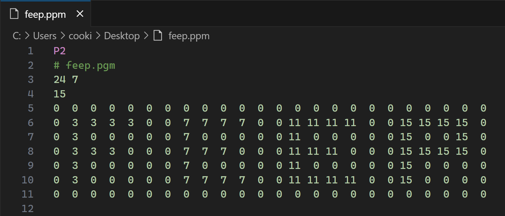

# Netpbm

Language support for `.pnm`, `.pbm`, `.pgm`, and `.ppm` files

## Features

- Error checking
- Syntax highlighting
- Auto formatting

<picture>
  <source media="(prefers-color-scheme: dark)" srcset="images/syntax-highlighting-dark.webp">
  <source media="(prefers-color-scheme: light)" srcset="images/syntax-highlighting-light.webp">
  
</picture>

<!--
## Requirements

If you have any requirements or dependencies, add a section describing those and how to install and configure them.
-->

<!--
## Extension Settings

Include if your extension adds any VS Code settings through the `contributes.configuration` extension point.

For example:

This extension contributes the following settings:

- `myExtension.enable`: Enable/disable this extension.
- `myExtension.thing`: Set to `blah` to do something.
-->

<!--
## Known Issues

Calling out known issues can help limit users opening duplicate issues against your extension.
-->
